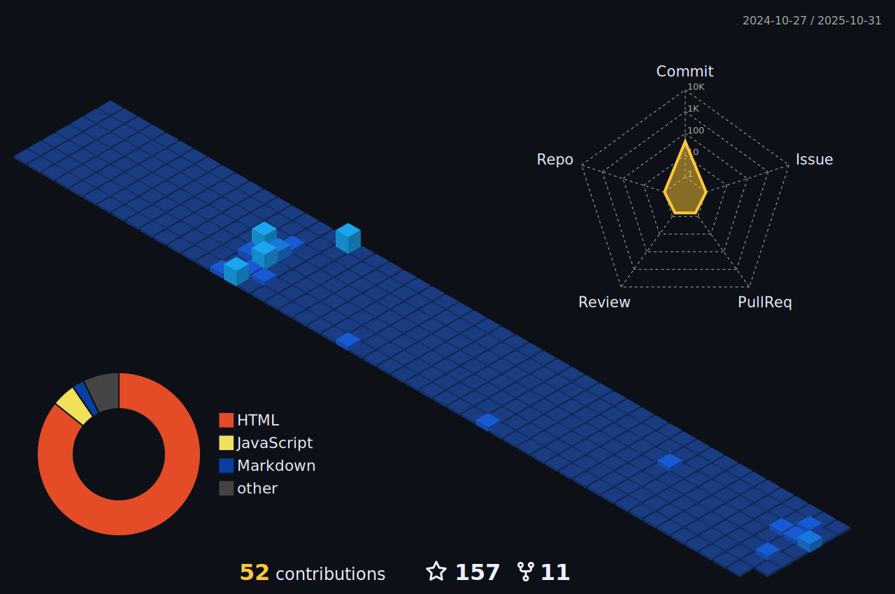

  

  
  
  <!-- Social icons section -->

  
  &#8287;&#8287;&#8287;&#8287;&#8287;
  
  &#8287;&#8287;&#8287;&#8287;&#8287;
  
  &#8287;&#8287;&#8287;&#8287;&#8287;
  
  &#8287;&#8287;&#8287;&#8287;&#8287;
  
  &#8287;&#8287;&#8287;&#8287;&#8287;

 

<!-- Social badges section -->
<!-- Badges with custom icons - https://github.com/DenverCoder1/custom-icon-badges -->
<!-- View counter - https://github.com/DenverCoder1/Simple-View-Counter -->

  
  <a href="https://github.com/Julius-Ulee?tab=repositories">
    
  
  
   
  

 <!-- spotify -->
  

 <!-- playlist -->
  <a href="https://open.spotify.com/playlist/3T4FA6oFSshCBVOz96OmBc"> <!-- genshin impact music -->

  <a href="https://open.spotify.com/playlist/2kpKIV6i5hafkZtvKCcOHB"> <!-- pop music -->

    <a href="https://open.spotify.com/playlist/7JPfNoSSMnFpoS9k0cqPx8"> <!-- old music -->

    <a href="https://open.spotify.com/playlist/1FWq5Cu05LmtSHgFEXRnZO"> <!-- programmer music -->
Programming%20Music-%231DB954.svg?&style=flat-square&logo=spotify&logoColor=white">

 

<h2>🌠 Donate</h2>

<table>
    <tr>
      <th>Rp. 5k Minimum</th>
      <th>Bitcoin</th>
    <tr>
      <td>
        
      </td>
      <td>
        
      </td>
    </tr>
  </table>
  

 
 
  
 
  
<h2>📘 My Top Open Source Projects</h2>

  <!-- Repo info cards - https://github.com/anuraghazra/github-readme-stats -->
  <!-- Small repo cards (fork) - https://github.com/DenverCoder1/github-readme-stats -->
  

    
    
     
     
     
     
    
    
    
    

    

      
  

    
<h2>📕 Top Projects I've Contributed To</h2>

     

        
       
       
    

    
  

  
      
  
 
  
<h2>🛠️ My Favorite Tools</h2>

  <!-- Some badges are from https://github.com/Ileriayo/markdown-badges -->

  <h3>👨‍💻 Programming and Markup Languages</h3>

  

      
      
      
      
      
      
      
      
      
      
      
      
      
      
  

  <h3>🧰 Frameworks and Libraries</h3>

  

      
      
      
      
      
      
      
      
      
  

  <h3>🗄️ Databases and Cloud Hosting</h3>

  

      
      
      
      
      
      
      
      
      
  

  <h3>💻 Software and Tools</h3>

  

      
      
      
      
      
      
      
      
      
      
      
      
      
  

 
  
<h2>📊 Github Stats and Activity</h2>

  
  <h3>🔥 Streak Stats</h3>
  

  

  <h3>💻 GitHub Profile Stats</h3>

  <!-- https://github.com/anuraghazra/github-readme-stats -->

  
  
  <a href="https://github.com/Julius-Ulee"><source media="(prefers-color-scheme: light)" srcset="src/images/profile-3d/profile-custom-season.svg" width = "98%">
    </a>
   
  

  
  > **Note**
  > Top languages is only a metric of the languages my public code consists of and doesn't reflect experience or skill level.
  
  <!-- https://github.com/ashutosh00710/github-readme-activity-graph -->

  
      
<h3>⚡ Recent GitHub Activity</h3>

<!-- https://github.com/jamesgeorge007/github-activity-readme -->
<!--START_SECTION:activity-->
1. 🔒 Closed issue [#37](https://github.com/Julius-Ulee/Status/issues/37) in [Julius-Ulee/Status](https://github.com/Julius-Ulee/Status)
2. 🔒 Closed issue [#40](https://github.com/Julius-Ulee/Status/issues/40) in [Julius-Ulee/Status](https://github.com/Julius-Ulee/Status)
3. 🗣 Commented on [#40](https://github.com/Julius-Ulee/Status/issues/40#issuecomment-1744064587) in [Julius-Ulee/Status](https://github.com/Julius-Ulee/Status)
4. 🔒 Closed issue [#39](https://github.com/Julius-Ulee/Status/issues/39) in [Julius-Ulee/Status](https://github.com/Julius-Ulee/Status)
5. 🗣 Commented on [#39](https://github.com/Julius-Ulee/Status/issues/39#issuecomment-1744064569) in [Julius-Ulee/Status](https://github.com/Julius-Ulee/Status)
<!--END_SECTION:activity-->

<h3>📕 Latest Blog Posts</h3>

<!-- BLOG-POST-LIST:START -->
 - 📘 [School Program: Traditional High School](https://julius-ulee.github.io/posts/school-program/)
 - 📕 [Announcement Anime](https://julius-ulee.github.io/posts/announcement-anime/)
 - 📙 [🦖Holobyte Hunter: Life of Pegasaurus](https://julius-ulee.github.io/posts/holobyte/)
 - 📙 [Daily Check-In Genshin Impact, Honkai Impact, Honkai: Star Rail](https://julius-ulee.github.io/posts/daily-check-in/)
 - 📕 [Genshin Impact / Honkai: Star Rail: Stats, Auto Claim Daily Rewards, Auto Redeem Code](https://julius-ulee.github.io/posts/genshin-starrail/)<!-- BLOG-POST-LIST:END -->

<h3>📔 Latest School Programs Posts</h3>

<!-- School-Programs:START -->
 - 📘 [Logika dan Algoritma](https://julius-ulee.github.io/School-Programs/learn/pengertian-dasar-logika-dan-algoritma/)
 - 📕 [Seperti Jessica Kumala Wongso, Wanita Ini Didakwa Kasus Pembunuhan Pakai Sianida](https://julius-ulee.github.io/School-Programs/article/jessica/)<!-- School-Programs:END -->

<h2>🆠My Trophy</h2>

  

  

  

  
<h2>✨ Quotes For Today</h2>

  
ÙˆÙÙ„Ùوْطًا اÙذْ Ù‚Ùال٠لÙÙ‚ÙوْمÙهٖٓ اÙتÙأْتÙوْن٠الْÙÙاحÙØ´ÙØ©Ù Ù…Ùا سÙبÙÙ‚ÙÙƒÙمْ بÙÙ‡Ùا Ù…Ùنْ اÙØ­Ùد٠مÙّن٠الْعٰلÙÙ…Ùيْن٠. اÙنّÙÙƒÙمْ Ù„ÙتÙأْتÙوْن٠الرّÙجÙال٠شÙهْوÙةً مّÙنْ دÙوْن٠النّÙسÙاۤءÙÛ— بÙلْ اÙنْتÙمْ Ù‚Ùوْمٌ مّÙسْرÙÙÙوْنÙ

  
<code>"And (We have also sent) Luth, when he said to his people, 'Why have you done a heinous deed, which no one before you has done (in this world). Truly, you have vented your martyrdom on your fellow men and not on women You are really a transgressive people."</code>

  <h3 align="center">🌎 Find me around the web</h3>
  

  
  
  
  
  
  
  
  

  
<h3 align="center">🚩 Campfire Communities</h3>
  
Wanna have chat with me? Join my Campfire communities!
    

  

  

  

  <!--

  
  
 -->

  
<h2>🐍 Watch my contribution graph get eaten by the snake</h2>

  

  

